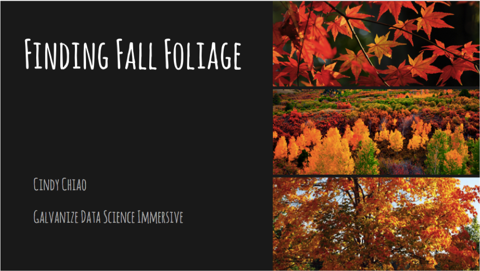
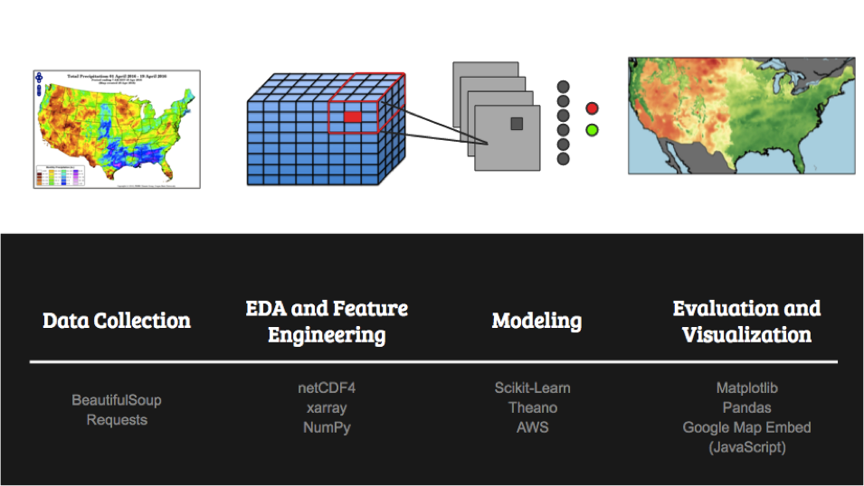
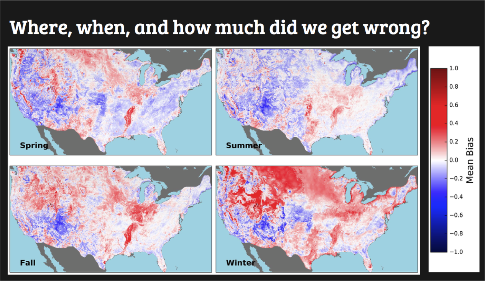
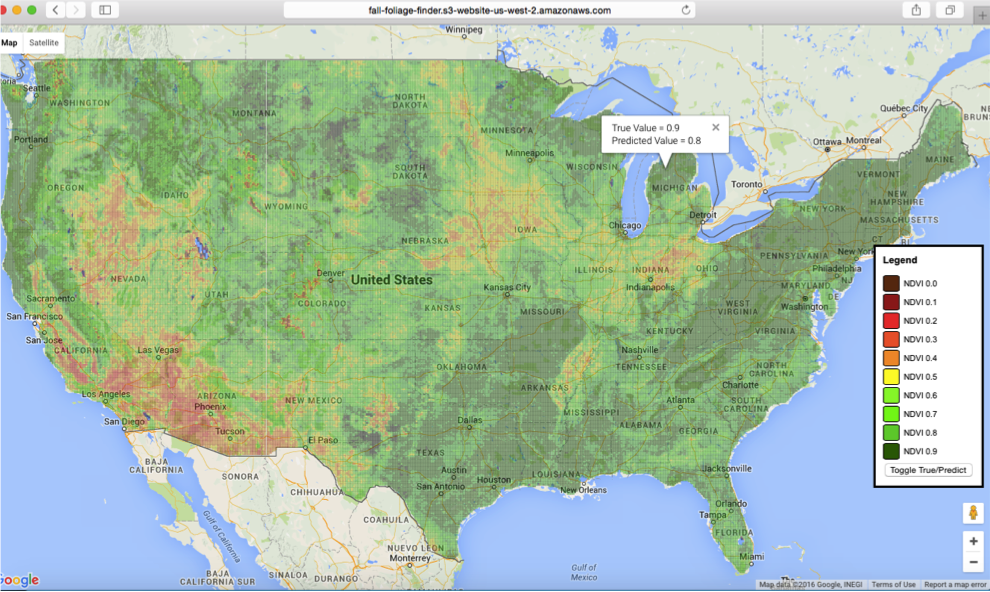

The goal of this project is to predict the timing of leaves changing colors in the Fall so that we can better plan our trips to see the Fall foliage. This project is completed as the capstone project for the Galvanize Data Science Immersive program, Seattle February 2016 cohort. 

## Data
I used NASA's LandSat satellite data ([NDVI](http://earthobservatory.nasa.gov/Features/MeasuringVegetation/measuring_vegetation_1.php)) to calculate my labels, which is a normalized "greenness" index available at 8-days interval. Since this is a forecast problem, the labels are the value for each pixel two timepoints in the future (i.e. 16 days). The label values were then normalized by the historic maximum value at that pixel. I used the historic and forecasted weather data, vegetation classification, and geographic information as my input features. 

## Methods

The K Means algorithm was used to cluster various locations of the continental U.S. based on similarity of historic weather normals, vegetation classes, and elevation. For each of the eight clusters identified, a neural network of the same structure was trained to predict the location's greenness value in the future. I used [theano](http://deeplearning.net/software/theano/)'s implementation of neural networks in Python. I trained the neural network using recent and forecasted weather data near the location to be predicted, while leaving out a fraction of the data as the test set. I then tested the R-squared value of the neural network predictions vs. actual. All training was done on AWS GPU instances to reduce the training time. 

## Results

Overall model performance (of all 8 models) was assessed through mapping of seasonal biases (predicted value - true value). The red values indicate an over-prediction (predicting that the leaves are green when they're not); whereas the blue values indicate an under-prediction (predicting that the leave are not green when they indeed are). 

An user interface can be built with the Google Map API where actual or predicted values are overlaid on top of Google Map. An example is shown above. 

## Future Work
* Verify satellite data derived labels with crowd-sourced information (e.g. Twitter, Instagram posts)
* Adding other features in non-time series formats to build an ensemble model
* Looking at changes in pixel color between timepoints

